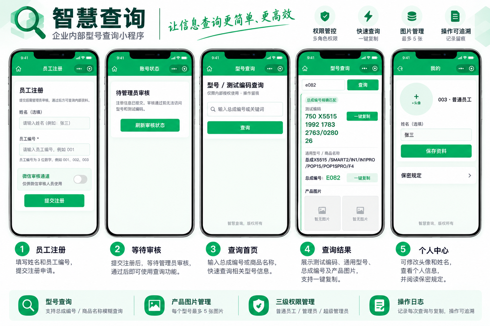
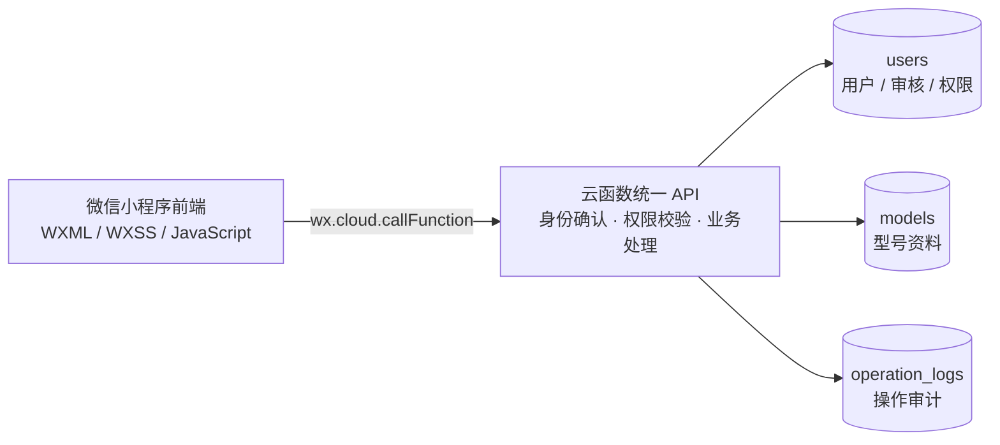
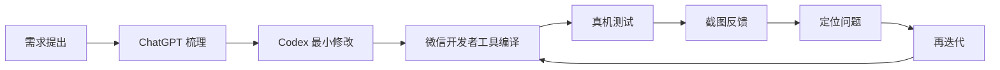

# 智慧查询

> 基于微信原生小程序 + 云开发的企业内部型号查询与权限管理系统


## 项目一句话介绍

把分散在 Excel 和人工问询中的型号资料，整理为一个支持统一查询、分级权限与操作审计的企业内部微信小程序。

## 解决什么问题

传统方式依赖 Excel 文件流转和人工检索：查询入口不统一，资料更新后难以及时同步，人员权限边界不清，关键操作也不易追溯。智慧查询将员工准入、保密确认、型号检索、资料维护和日志审计串成一条可管理的业务链路，让员工能够按授权自助查询，管理员能够审核账号并维护数据。

## 核心功能速览

| 功能 | 说明 |
| --- | --- |
| **员工注册审核** | 员工提交注册信息后进入待审核状态，由管理员通过、拒绝或删除账号 |
| **三级权限** | `user`、`admin`、`super_admin` 分工明确，敏感操作由服务端校验 |
| **型号查询** | 按总成编号或商品名称检索，支持多结果展示 |
| **一键复制** | 快速复制查询结果中的测试编码或通用型号 |
| **型号管理** | 管理员新增、修改、删除和批量导入型号；普通员工仅可使用被单独授予的维护能力 |
| **图片管理** | 每个型号最多维护 5 张图片，并支持查看与删除 |
| **操作日志** | 记录登录、查询、复制及关键管理操作，便于追溯 |
| **好友分享** | 从查询首页分享给微信好友 |

## 📱 项目实机界面与使用流程

<p align="center">
  
</p>

> 从员工注册、管理员审核，到型号查询、结果展示及个人资料管理的完整使用流程。展示数据均为作品集示例数据。

## 使用流程


## 权限架构

| 能力 | `user` | `admin` | `super_admin` |
| --- | --- | --- | --- |
| 查询、查看与复制 | 审核通过并确认保密后可用 | 可用 | 可用 |
| 上传型号图片、编辑总成编号 | 默认不可用；管理员可逐项授权 | 可用 | 可用 |
| 型号新增、完整编辑、删除与批量导入 | 不可用 | 可用 | 可用 |
| 员工审核、权限配置与日志查看 | 不可用 | 可用 | 可用 |
| 授予或取消管理员角色 | 不可用 | 不可用 | 可用 |

前端按角色展示入口以改善使用体验，最终权限判断仍在云函数执行。

## 系统架构



客户端通过统一云函数 API 发起业务请求，不直接读取或修改上述敏感集合；角色和细粒度权限由服务端校验。

## AI 协作开发流程



AI 用于需求澄清、风险分析和局部实现辅助；功能判断、测试反馈与最终验收由开发者结合真实业务完成。

## 项目难点与复盘

| 难点 | 现象 | 定位 | 解决 |
| --- | --- | --- | --- |
| 旧云环境启动问题 | 项目导入后无法正常进入业务流程 | 项目关联环境与客户端初始化配置不一致 | 核对云环境绑定并将公开仓库配置改为安全模板 |
| session / 权限缓存 | 管理页面显示的角色能力与实际账号不一致 | 页面沿用旧 session，未及时同步服务端状态 | 关键管理页重新拉取 session，敏感操作继续由服务端鉴权 |
| 分享好友排查 | 查询页无法正常使用好友分享菜单 | 正式页面缺少页面级分享生命周期 | 在查询页补齐好友分享处理并通过真机验证 |
| 微信审核 / 注册流程调整 | 审核访问与真实员工注册链路互相影响 | 审核账号和正式员工共用流程但生命周期不同 | 增加可关闭、可轮换的审核访问机制，并避免向客户端暴露凭据 |

更完整的设计取舍、排查过程与项目收获见 [项目复盘文档](docs/PROJECT_REVIEW.md)。

## 我的工作

- 将业务目标拆解为注册审核、保密确认、查询、维护、权限与审计链路
- 参与功能设计，并通过 ChatGPT 与 Codex 协作完成可控的局部代码迭代
- 使用微信开发者工具编译，结合 Android 真机完成交互与分享测试
- 根据 session、页面生命周期和服务端权限边界定位问题并持续迭代版本
- 面向公开作品集完成数据脱敏、配置清理、敏感信息扫描与安全审计

## 技术栈与项目结构

- 微信原生小程序：JavaScript、WXML、WXSS
- 微信云开发 / CloudBase：Node.js 云函数、云数据库、云存储

```text
miniprogram/          小程序页面、样式和客户端工具
cloudfunctions/api/   统一云函数 API、鉴权和业务处理
demo/                 明确标记的虚构演示数据
docs/                 部署、安全规则与详细项目复盘
scripts/              数据校验、导入准备和契约测试
```

核心集合为 `users`、`models` 和 `operation_logs`。公开仓库只展示结构；虚构示例见 [`demo/models.demo.json`](demo/models.demo.json)，记录均带有 `_demo: true`。

## 本地运行

1. 使用微信开发者工具导入项目根目录。
2. 将 `project.config.json` 中的测试 AppID 换成自己的小程序 AppID。
3. 配置自己的云开发环境；作品集仓库中的 `miniprogram/env.js` 默认留空。
4. 在云函数环境变量中配置所需字段，字段名参考 `.env.example`。
5. 使用虚构 Demo 数据初始化测试集合，禁止混入真实公司数据。

## 作品集说明 / 隐私说明

> [!IMPORTANT]
> 本仓库是用于能力展示的**脱敏作品集版本**。真实公司数据、用户信息、OpenID、Excel 文件、操作日志、云环境信息和公司内部型号均未公开；`demo/` 中的数据仅为虚构展示数据，不对应真实业务记录。

公开使用前，请继续遵循最小权限原则，并使用自己的小程序与云开发环境配置。
